 

<h1 align="center">Hi 👋, I'm Inzamam Yousaf</h1>
<h3 align="center">A passionate Web Developer and AI Enthusiastic.</h3>

  

- 🔭 I have completed a [Data Science Project of Image Classification](https://github.com/Inzamam1121/Currency-Detection.git)

- 🌱 I’m currently learning **MERN stack and Python for ML**

- 👯 I’m looking to collaborate on **AI/ML Projects**

- 🤝 I’m looking for help with **good placement**

- 👨‍💻 All of my projects are available at [https://github.com/Inzamam1121](https://github.com/Inzamam1121)

- 💬 Ask me about **MERN and ML**

- 📫 How to reach me **l201121@lhr.nu.edu.pk**

- ⚡ Fun fact **I am not done yet👨‍💻**

 

  

<h3 align="left">Connect with me:</h3>

# Skills 

| Category        | Skills        |
|-----------------|---------------|
| Web Development | <a href="https://www.w3.org/html/" target="_blank" rel="noreferrer">  <a href="https://www.java.com" target="_blank" rel="noreferrer">  <a href="https://developer.mozilla.org/en-US/docs/Web/JavaScript" target="_blank" rel="noreferrer">  |
| Web Frameworks | <a href="https://angular.io" target="_blank" rel="noreferrer">  <a href="https://raw.githubusercontent.com/devicons/devicon/master/icons/angularjs/angularjs-original-wordmark.svg" alt="angularjs" width="40" height="40"/> <a href="https://raw.githubusercontent.com/devicons/devicon/master/icons/mern/mern-original.svg" alt="mern" width="40" height="40"/> |
| Programming Languages | <a href="https://www.cprogramming.com/" target="_blank" rel="noreferrer">  <a href="https://www.w3schools.com/cpp/" target="_blank" rel="noreferrer">  <a href="https://www.w3schools.com/cs/" target="_blank" rel="noreferrer">  <a href="https://www.java.com" target="_blank" rel="noreferrer">  <a href="https://developer.mozilla.org/en-US/docs/Web/JavaScript" target="_blank" rel="noreferrer">  <a href="https://www.ruby-lang.org/en/" target="_blank" rel="noreferrer">  <a href="https://www.python.org" target="_blank" rel="noreferrer">  |
| Frontend Technologies | <a href="https://www.w3schools.com/css/" target="_blank" rel="noreferrer">  <a href="https://dart.dev" target="_blank" rel="noreferrer">  <a href="https://reactjs.org/" target="_blank" rel="noreferrer">  <a href="https://angular.io" target="_blank" rel="noreferrer">  <a href="https://tailwindcss.com" target="_blank" rel="noreferrer">  <a href="https://www.w3.org/html/" target="_blank" rel="noreferrer">  <a href="https://getbootstrap.com" target="_blank" rel="noreferrer">  <a href="https://sass-lang.com" target="_blank" rel="noreferrer">  |
| Backend Technologies | <a href="https://expressjs.com" target="_blank" rel="noreferrer"><a href="https://flask.palletsprojects.com/" target="_blank" rel="noreferrer"><a href="https://nodejs.org" target="_blank" rel="noreferrer">|
| Version Control & Devops| <a href="https://git-scm.com/" target="_blank" rel="noreferrer">  |
| Database Systems | <a href="https://www.mongodb.com/" target="_blank" rel="noreferrer">  <a href="https://www.microsoft.com/en-us/sql-server" target="_blank" rel="noreferrer">  <a href="https://www.mysql.com/" target="_blank" rel="noreferrer">  <a href="https://pandas.pydata.org/" target="_blank" rel="noreferrer">  |
| Server-side Development | <a href="https://nodejs.org" target="_blank" rel="noreferrer">  |
| Databases | <a href="https://www.oracle.com/" target="_blank" rel="noreferrer">  <a href="https://www.sqlite.org/" target="_blank" rel="noreferrer">  <a href="https://www.microsoft.com/en-us/sql-server" target="_blank" rel="noreferrer">  <a href="https://mariadb.org/" target="_blank" rel="noreferrer">  <a href="https://www.postgresql.org" target="_blank" rel="noreferrer">  |
| Data Science | <a href="https://opencv.org/" target="_blank" rel="noreferrer">  <a href="https://www.tensorflow.org" target="_blank" rel="noreferrer">  <a href="https://scikit-learn.org/" target="_blank" rel="noreferrer">  <a href="https://pandas.pydata.org/" target="_blank" rel="noreferrer"> <a href="https://seaborn.pydata.org/" target="_blank" rel="noreferrer">  |
| Game Development | 	<a href="https://unity.com/" target="_blank" rel="noreferrer">  |
| Mobile Development | 	|
| Learning |    |

 

<!-- # Projects 

| Projects | Deployed Link | Repository | Tech Stack & Tools |
|:---------|:-------------:|:----------:|:-------------------|
| Designlyfe | [Designlyfe](https://www.designlyfe.tech/) | - | `Next.js` `TypeScript` `React` `Firebase` `Tailwind CSS` `Simple Analytics` `Pageclip` `Postman` |
| WaitSmart | [view](https://wait-smart-chi.vercel.app/) | [view](https://github.com/Anmol-Baranwal/WaitSmart) | `Next.js` `JavaScript` `React` `Firebase` `Chakra UI` `CSS3` |
| Coffee Compass | [view](https://coffee-project-anmol-baranwal.vercel.app/) | [view](https://github.com/Anmol-Baranwal/Coffee-Compass) | `Next.js` `JavaScript` `Postman` `Airtable Database` `CSS3` |
| MongoDB Query Fetcher | [view](https://mongodb-query-fetcher.vercel.app/) | [view](https://github.com/Anmol-Baranwal/FullStack-MongoDB-Query-Fetcher) | `Next.JS` `Node.JS` `Express.JS` `JavaScript` `MongoDB` `CSS3` `MongoDB Compass` `Postman` |
| Plasmo Chrome Extension | - | [view](https://github.com/Anmol-Baranwal/country-chrome-extension) | `Plasmo Framework` `TypeScript` `Tailwind CSS` `Google Chrome Browser`
| ToDo List Web App | [view](https://todo-list-k7qu.onrender.com/) | [view](https://github.com/Anmol-Baranwal/ToDo-List-WebApp) | `Node.JS` `Express.JS` `JavaScript` `MongoDB` `Bootstrap` |
| BabySteps | [view](https://baby-steps-rho.vercel.app/) | [view](https://github.com/Anmol-Baranwal/BabySteps-Project) | `Next.js` `JavaScript` `Postman` `CSS3` |
| Client's Portfolio | [view](https://anmol-baranwal.github.io/Portfolio-Akanksha/) | [view](https://github.com/Anmol-Baranwal/Portfolio-Akanksha) | `JavaScript` `Bootstrap` `jQuery` `Vanilla Tilt` `Owl Carousel` `Typed JS` |
| Notes Keeper App | [view](https://notes-keeper-app-i91s.vercel.app/) | - | `React` `JavaScript` `CSS3` `HTML5` |
| Password Power | [view](https://password-generator-anmol-baranwal.vercel.app/) | - | `JavaScript` `CSS3` `HTML5` |
| Color Shade Tool | [view](https://color-darken-tool.vercel.app/) | - | `JavaScript` `CSS3` `HTML5` |
| Conceptual Mini Projects | - | [view](https://github.com/Anmol-Baranwal/Conceptual-Projects) | `JavaScript` `SCSS` `Tailwind` `jQuery` `Node.JS` `Express.JS` `CSS3` |
| C++ Special Programs | - | [view](https://github.com/Anmol-Baranwal/CPP-Special-Programs) | `C++` |

  -->

# Metrics

  
Expand

| Overview | Follow up Issues & PRs |
|:--------:|:-------------------------:|
|  |  |
| Leetcode Stats | Notable Contributions |
|  |  |
| Achievements | Language Activity |
|  |  |
| Discussions | Reactions |
|  |  |

 

<!--- ------------------------------------------------------------------------------------------------------------------------------------------------------ -->
<!--- -- My Socials ---------------------------------------------------------------------------------------------------------------------------------------- -->
<!--- ------------------------------------------------------------------------------------------------------------------------------------------------------ -->

#  The Online Hangout

  
   
  
  
   
  
  
  
   
  
  
  
  
  <a href="https://discordapp.com/users/776749637826117640">
  

<!--- ------------------------------------------------------------------------------------------------------------------------------------------------------ -->
<!--- -- Support Me Here ----------------------------------------------------------------------------------------------------------------------------------- -->
<!--- ------------------------------------------------------------------------------------------------------------------------------------------------------ -->

#  Please Support Me Here

  

<!--- ------------------------------------------------------------------------------------------------------------------------------------------------------ -->
<!--- -- GitHub Stats ------------------------------------------------------------------------------------------------------------------------------------ -->
<!--- ------------------------------------------------------------------------------------------------------------------------------------------------------ -->

|  |  |
| -- | -- |

<!--- ------------------------------------------------------------------------------------------------------------------------------------------------------ -->
<!--- -- Snake Contribution Graph -------------------------------------------------------------------------------------------------------------------------- -->
<!--- ------------------------------------------------------------------------------------------------------------------------------------------------------ -->

